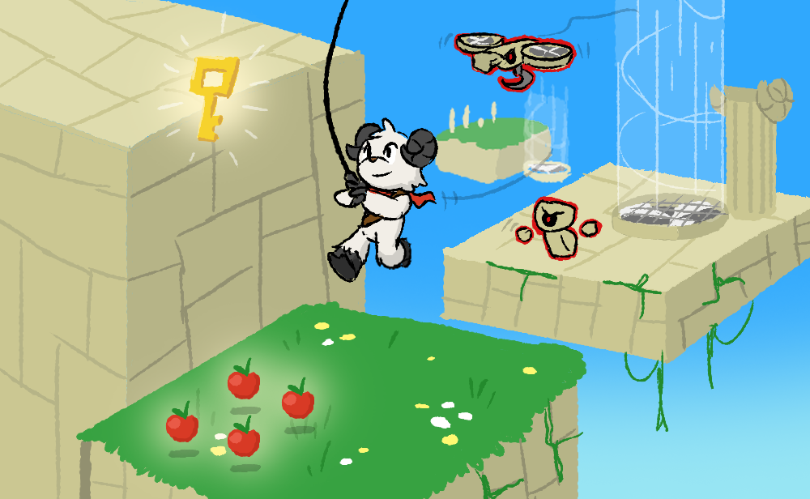

# Briefing
{nome do jogo} é um jogo de plataforma 3D que tem como referência grandes nomes do gênero para se inspirar em mecânicas que trouxeram e trazem uma boa jogabilidade, como o icônico level design de Super Mario 64, o sistema de câmeras de Super Mario Odissey e as mecânicas diferentes de cada fase do novo Split Fiction.

O jogo traz um estilo estético estilizado e cartunesco, mantendo o jogo em classificação livre e com um gráfico bonito que pode ser executado em uma gama maior de dispositivos, os gráficos tem como referência jogos grandes e consagrados como Super Mario Odissey e A Hat in Time e novos jogos indies como Haste: Broken Worlds.

Com uma temática que se passa em um mundo distante de seu auge com ruínas incorporadas com a natureza e animais antropomórficos o jogador navega pelo mundo controlando um bode que utiliza de um grappling hook para ajudar a solucionar desafios de plataforma e puzzles em busca de coletar um objeto para concluir a missão.

Cada mundo contém várias missões que fazem o jogador explorar diferentes partes da fase, esse modelo de level design não só aumenta a produtividade da equipe devido o reuso de assets como também cria uma maior imersão do jogador por estar vivenciando o mesmo mundo de diferentes maneiras. Para aumentar a diversidade na jogabilidade, cada mundo tem uma mecânica única, como ventiladores que empurram o jogador, que é explorada de diferente maneiras em cada missão, aumentando a complexidade conforme o jogador vai se familiarizando com as mecânicas, assegurando que o jogador terá sempre uma experiência nova mesmo em um ambiente similar.

{nome do jogo} busca trazer uma experiência polida de gameplay para o jogador experienciar tanto com controles e no mouse e teclado, aumenta a acessibilidade e se adequando a maneira preferida de jogar de cada um.

Nosso foco está em entregar a melhor experiência possível com a jogabilidade e com gráficos bonitos para tornar um jogo que o jogador se divirta e aprecie durante toda a duração do jogo.

# Membros da Equipe
- Artur Amorim Damasio da Silva (RA00318690) - Enemy Design, Environment Design
- Gabriel Tury (RA00318926) - Gameplay Programmer, Game Design
- Gabriel W. (RA00320450) - Music, SFX, VFX
- Mateus Martins Torres (RA00318801) - Level Design, Environment Design
- Ryann Thierry Passos de Medeiros (RA00320452) - UI/UX Programming & Design
- Vitor Hickmann (RA00319948) - 3D Artist

